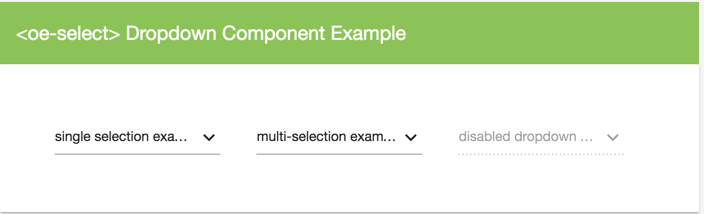
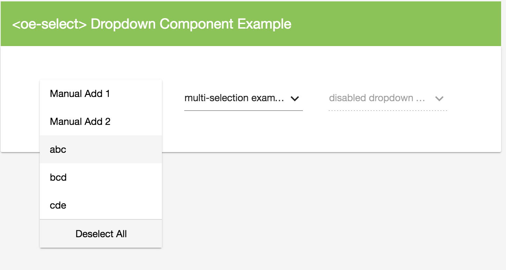
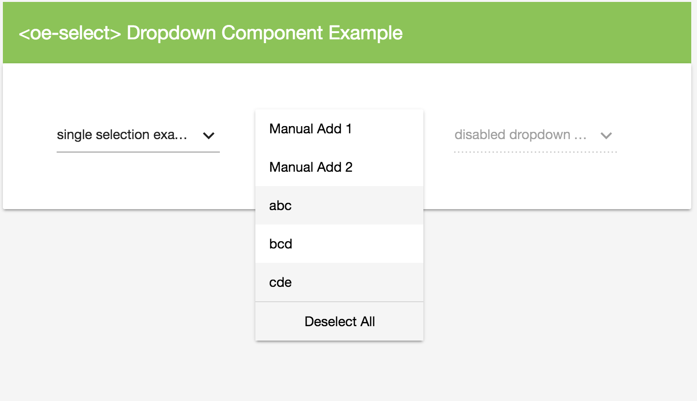

# Dropdown Component for Angular 2 (with Google Material 2)



### Dependencies

* Google Material (Angular Material 2) - MdInputModule, MdIconModule
* Angular 2, RC5

### Usage

Simply reference the **OE_MD_SelectModule** same way as you import other modules, and then start using <oe-select> and <oe-option> as explained below
#### Import Module: OE_MD_SelectModule
##### Angular 2 - RC5
```javascript
@NgModule({
    imports:[CommonModule, OE_MD_SelectModule],
    declarations:[],
    providers:[],
    exports:[]
})
export class YourModule{
}

```

### Simple Examples

```html
                <oe-select placeHolder="love my own work" [items]="[{a:'abc',b:1,c:true},{a:'bcd',b:2},{a:'cde',b:3}]" [allowMultiple]="true">
                </oe-select>
                <oe-select placeHolder="disabled one" [disabled]="true"
                           [items]="[{a:'abc',b:1},{a:'bcd',b:2},{a:'cde',b:3}]">
                </oe-select>
```


### Elements and Attributes

### <oe-select>
the wrapper of the dropdown, equivalent to <select></select>

#### properties
| Property | value type | description |
|---|---|---|
| **items** | object array | defines an **array** of data items for the dropdown to use |
| **selectorId** | string | definea the name of the current selector - a GUID will be populated as selectorId if it is not manually defined |
| **selectedItems** | object array | returns a list of selected items (if it is a single item selection dropdown, it will have maximum 1 item in the returned array) |
| **selectedText** | string | returns the current selected text; or the default placeholder text if no item selected |
| **placeHolder** | string | defines the default placeholder for the dropdown |
| **disabled** | bool | defines whether the current dropdown is disabled |
| **textBinding** | string | defines a property name from the object in **item** array, the value of the property from the object will be injected as the item options' display **text** |
| **valueBinding** | string | defines a property name from the object in **item** array, the value of the property from the object will be injected as the item options' display **value** |
| **stateBinding** | string | defines a property name from the object in **item** array, the value of the property from the object will be injected as the item options' display **isSelected** |
| **allowMultiple** | bool | define whether the dropdown allows selecting multiple items |


#### events
| Events | parameters | return value | description |
|---|---|---|---|
| onItemSelected($event) | $event | void | define a custom event using the (onItemSelected) property binding in <oe-select> to execute your own function when an item is **selected**, the $event contains the selected item data |
| onItemDeselected($event) | $event | void | define a custom event using the (onItemSelected) property binding in <oe-select> to execute your own function when an item is **deselected**, the $event contains the deselected item data |

````html
                <oe-select placeHolder="love my own work" [items]="[{a:'abc',b:1,c:true},{a:'bcd',b:2},{a:'cde',b:3}]"
                           valueBinding="b" textBinding="a" stateBinding="c"
                           (onItemDeselected)="onItemDeselected($event)"
                           (onItemSelected)="onItemSelected($event)"
                           [allowMultiple]="true">
                    <oe-option text="Manual Add 1" value="1234"></oe-option>
                    <oe-option text="Manual Add 2" value="1234"></oe-option>
                </oe-select>

 ````
* NOTE: -- remember to define the "onItemDeselected($event)" and "onItemSelected($event)" function in your component if you specified them in the property bindings

#### methods
| Methods | parameters | return value | description |
|---|---|---|---|
| show() | - | void | triggers the dropdown list to be shown |
| close() | - | void | triggers the dropdown list to be closed (if is shown) |

 


### <oe-option>
option items of the dropdown, equivalent to <option></option>
* NOTE: if all your data is loaded dynamically using the data items variable in <oe-select>, then you don't need to worry about using the <oe-option> which allows you to specify option items without a data load

#### properties
| Property | value type | description |
|---|---|---|
| **item** | object | defines an object which can be automatically loaded same way like other objects in the array, using the config options defined in <oe-select> |
| **text** | string | define the text displayed for the dropdown item; if no **item** object is defined, this **text** value will be automatically assigned onto an **item** object automatically for the component |
| **value** | string, any | defines the value to be assigned to the dropdown item; if no **item** object is defined, this **value** will be automatically assigned onto an **item** object for the component |
| **isSelected** | bool | define whether the item should be marked as selected |

#### methods
| Method | parameters | return value | description |
|---|---|---|---|
| toggleSelect() | - | void | trigger toggle events for the current option |
 


